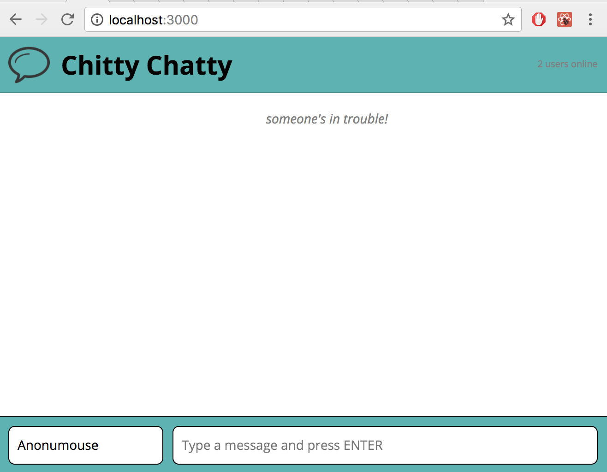
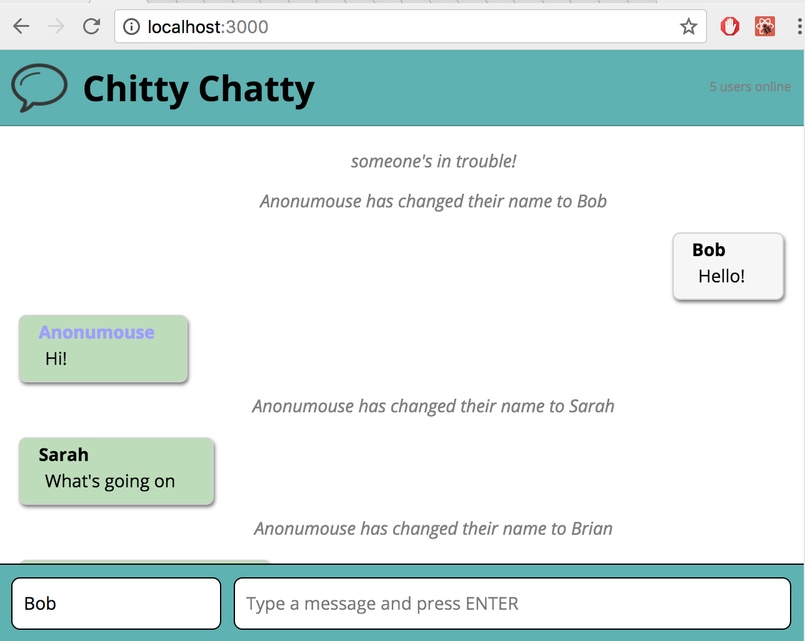

Chitty Chatty
=====================

A real-time multi-user messaging app built with ReactJS using WebSockets.


## Features

* Messages are sent by typing into the chatbar and pressing Enter.

* Username can be changed by typing a new username into the namebar and pressing enter. Defaults to "Anonumouse".

* When a username is changed, a system message will be sent to all online users in the chatroom.

* Display of users currently online in the chatroom

* Usernames are randomly assigned a colour, so that their name will appear in a color within their messages to help differentiate user messages

* Self-posted messages will appear on the right-side of the message list, and messages from other users will appear on the left-side.




## Getting Started

1. Clone his repo to your local machine.

2. Install the dependencies by entering ```npm i``` in the CLI.

3. Start the http server with ```npm start```

4. Concurrently start the websocket server within the ```chatty-server``` folder using the ```node server.js``` command.

5. View the website at ```http://locathost:3000``` in the browser.

6. Open multiple users by opening multiple tabs within the browser and visiting the website at ```http://locathost:3000```


## Dependencies

* babel-core
* babel-loader
* babel-preset-es2015
* babel-preset-react
* babel-preset-stage-0
* css-loader
* node-sass
* react
* react-dom
* sass-loader
* sockjs-client
* style-loader
* webpack
* webpack-dev-server

Chatty_Server

* express
* ws